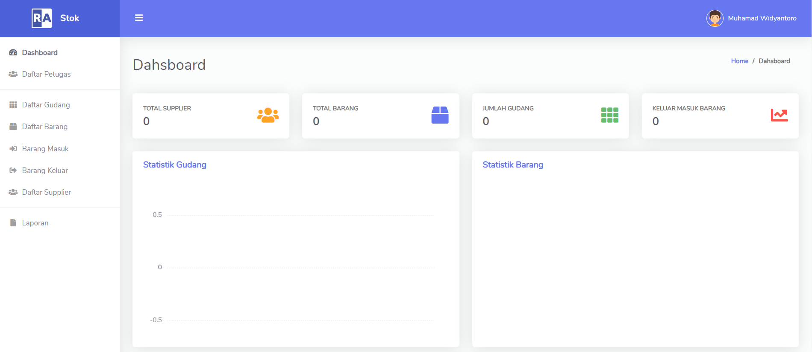
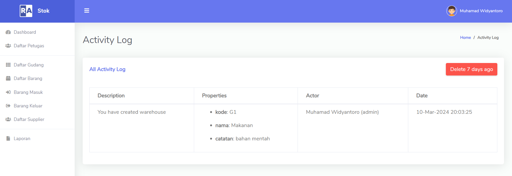
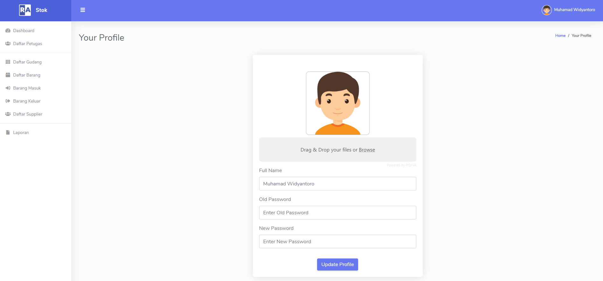
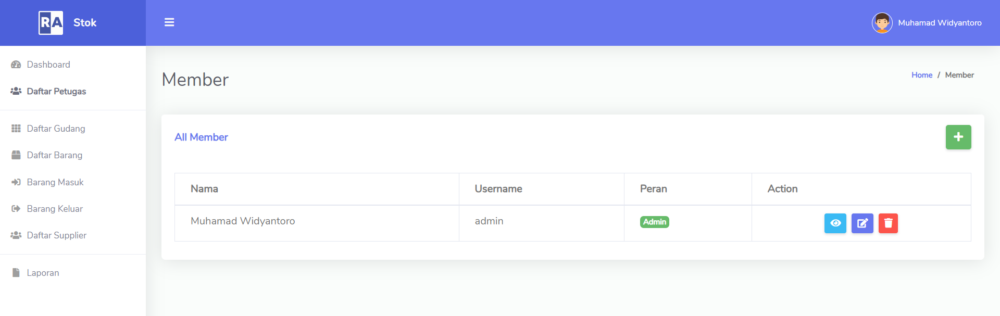
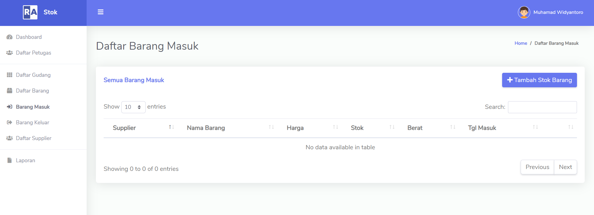
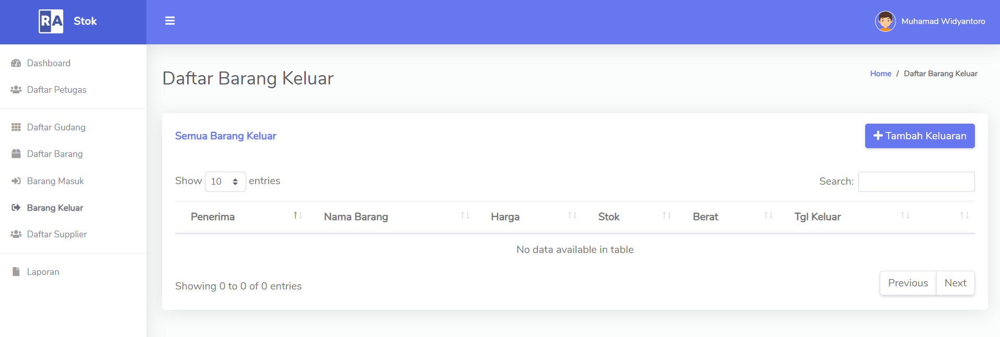
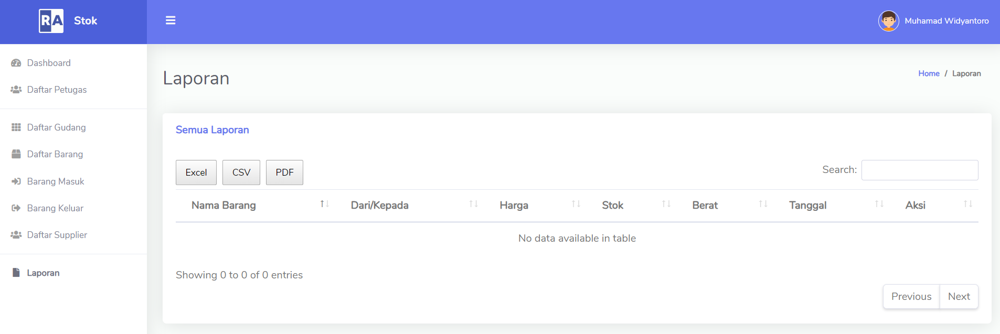

# Sistem Inventaris Gudang | Laravel + Bostraps

Sistem Inventaris Gudang yang meliputi Daftar Gudang,daftar Petugas,Daftar Supplier,Barang Masuk & keluar

## Fitur

- Dashboard
- Daftar petugas (admin, staff gudang/barang)
- Daftar barang
- Daftar gudang
- Daftar supplier
- Barang masuk
- Barang keluar
- Laporan
- Profile (ganti foto & password)

## Teknologi

**Fornt-End:** HTML, CSS, JavaScript, Bootstrap 

**Framework:** PHP, Laravel 

**Back-End:** MySql

## AKSES REPOSITORY

## Screenshots

**HALAMAN DASHBOARD** 

**HALAMAN LOG ACTIVITY** 

**HALAMAN PROFILE** 

**HALAMAN DAFTAR PETUGAS** 

**HALAMAN DAFTAR BARANG MASUK** 

**HALAMAN DAFTAR BARANG KELUAR** 

**HALAMAN LAPORAN BARANG** 

## Feedback

Berikan feedback atau Ingin Memproleh SourceCode:

**EMAIL DEVELOPER :** 

mikozua45@gmail.com

